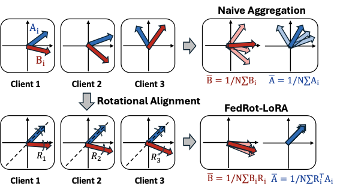

# FedRot-LoRA: Mitigating Rotational Misalignment in Federated LoRA

[](https://arxiv.org/abs/2602.23638)
[](https://icml.cc/virtual/2026/poster/66566)

This repository provides the official implementation of **FedRot-LoRA**, accepted to **ICML 2026**.

FedRot-LoRA addresses a core challenge in federated LoRA fine-tuning: the LoRA factors from different clients can be rotationally misaligned even when they represent semantically equivalent low-rank updates. Directly averaging those factors can therefore introduce aggregation error and unstable training. FedRot-LoRA aligns client LoRA factors with orthogonal transformations before aggregation, reducing destructive interference while preserving the represented update and maintaining the same communication footprint.

Paper links: [arXiv](https://arxiv.org/abs/2602.23638) | [ICML 2026 poster](https://icml.cc/virtual/2026/poster/66566)

## Overview

LoRA updates are invariant to rotations of the latent rank space:
$(B_i R_i)\left(R_i^T A_i\right) = B_i A_i$
Although the product is unchanged, the individual factors may reside in different client-specific coordinate systems. FedRot-LoRA solves an orthogonal alignment problem for each client before averaging the factors.

<p align="center">
  
</p>

## Highlights

- **Problem:** Factor-wise averaging preserves the LoRA rank but can deviate from the mathematically correct aggregation of client updates.
- **Key insight:** Rotational invariance creates cross-client latent subspace mismatch, causing aligned updates to interfere after naive averaging.
- **Method:** FedRot-LoRA applies orthogonal transformations to align local LoRA factors prior to server aggregation.
- **Benefits:** The alignment preserves the semantic update, does not increase communication cost, and improves stability across heterogeneity levels and LoRA ranks.
- **Evaluation:** Experiments cover natural language understanding and generative tasks, with comparisons against federated LoRA baselines.

## Implementation

The FedRot-LoRA implementation is built on top of FederatedScope-LLM. The main logic is located in:

- `federatedscope/rotation_alignment_tools.py`: Orthogonal Procrustes alignment and LoRA rotation utilities.
- `federatedscope/core/workers/client.py`: Client-side LoRA parameter handling and local update flow.
- `federatedscope/core/workers/server.py`: Server-side aggregation logic.
- `federatedscope/core/configs/cfg_llm.py`: LoRA and rotation-related configuration options.

Representative experiment configurations are provided in:

- `federatedscope/glue/yamls/base_fedrot_lora.yaml`
- `federatedscope/llm/yamls/base_fedrot_lora.yaml`

## Installation

The code has been tested with Python 3.10 and PyTorch 2.1.0.

```shell
conda create -n fedrot-lora python=3.10
conda activate fedrot-lora

pip install torch==2.1.0 torchvision==0.16.0 torchaudio==2.1.0 --index-url https://download.pytorch.org/whl/cu121
pip install -e .[llm]
pip install evaluate
```

If you use a different CUDA version, install the corresponding PyTorch wheel from the official PyTorch index before installing this package.

## Quick Start

Run FedRot-LoRA on GLUE-style natural language understanding tasks:

```shell
python federatedscope/main.py --cfg federatedscope/glue/yamls/base_fedrot_lora.yaml
```

Run FedRot-LoRA on LLM generative tasks:

```shell
python federatedscope/main.py --cfg federatedscope/llm/yamls/base_fedrot_lora.yaml
```

## Configuration

FedRot-LoRA is enabled through the `lora` configuration block. A typical setup uses:

```yaml
lora:
  method: "shareAB"
  rotate: True
  initialshare: "A"
```

Important options include:

- `lora.rotate`: Enables rotational alignment before aggregation.
- `lora.initialshare`: Selects the reference factor used for alignment, such as `A` or `B`.
- `lora.method`: Controls the LoRA sharing and aggregation strategy.
- `lora.rotate_lambda`: Controls softened rotation variants used in sensitivity or ablation studies.

Baseline and ablation configurations are available under `federatedscope/glue/yamls/` and `federatedscope/llm/yamls/`.

## Citation

If you find this repository useful, please cite:

```bibtex
@inproceedings{zhang2026fedrotlora,
  title = {FedRot-LoRA: Mitigating Rotational Misalignment in Federated LoRA},
  author = {Zhang, Haoran and Kim, Dongjun and Cha, Seohyeon and Vikalo, Haris},
  booktitle = {Proceedings of the 43rd International Conference on Machine Learning},
  year = {2026},
  url = {https://arxiv.org/abs/2602.23638}
}
```

## Acknowledgements

This implementation builds on the FedSA-LoRA codebase: [Pengxin-Guo/FedSA-LoRA](https://github.com/Pengxin-Guo/FedSA-LoRA).

We also thank the authors of [FederatedScope-LLM](https://github.com/alibaba/FederatedScope/tree/llm) for releasing their public repository.
